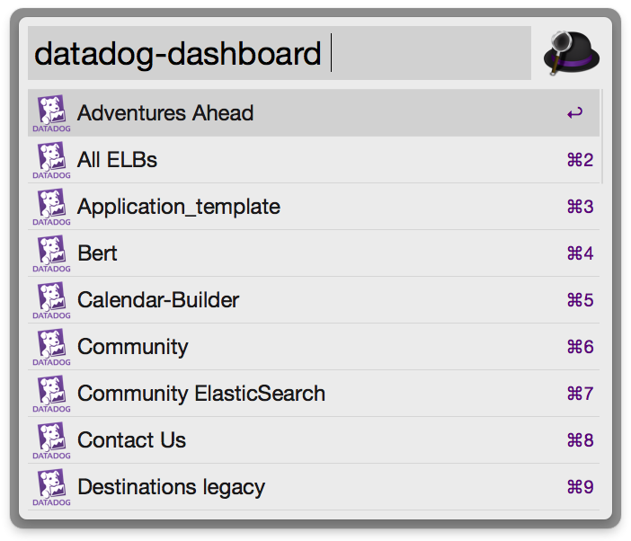

# alfred-datadog-dashboards-workflow

An Alfred workflow to search your [Datadog](https://www.datadoghq.com) dashboards and select one to open in your default browser.



## Installation

Clone this repo and run:

```
bin/install
```

## Configuration

The plugin needs a Datadog API key and Application key. You can find or create one on the ["Integrations" -> "APIs" page](https://app.datadoghq.com/account/settings#api).

Once you have the keys, create a file named `~/.datadogrc` with the following format:

```
export DATADOG_API_KEY=123yourapikey
export DATADOG_APP_KEY=123yourappkey
```

**make sure to restrict permissions on this file (ex. `chmod 600 ~/.datadogrc`)**
